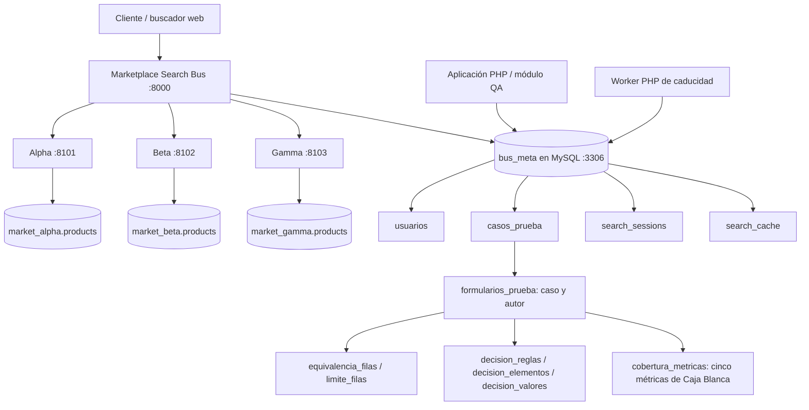

# Arquitectura de ISA3-P

El Bus consulta simultáneamente tres proveedores HTTP mediante cURL, normaliza sus contratos con adaptadores y aplica ordenamiento global. Persiste una SearchSession y su caché en `bus_meta`; el worker elimina físicamente las búsquedas caducadas y la clave foránea elimina su caché. Los catálogos de los proveedores viven en bases independientes.

El Proyecto 2 extiende el router, la autenticación y la navegación del Proyecto 1. La misma aplicación sirve `/login`, `/admin`, `/dashboard`, `/casos`, `/formularios`, `/usuarios`, `/busquedas` y el buscador. Apache puede servirla desde una subcarpeta; el servidor PHP del Bus utiliza el mismo router en 8000. No existe un segundo login ni una base QA independiente.

`usuarios` incorpora Administrador y Tester con contraseñas hash. `casos_prueba` referencia al autor; los permisos se comprueban en el servidor. El Administrador puede consultar y eliminar todos los casos; el Tester consulta y edita los propios. Las evidencias están en `.runtime/evidence`, fuera de Git y del acceso estático, y sus metadatos en MySQL. Las sesiones PHP se guardan en `.runtime/sessions`.

Las bases se extienden mediante SQL aditivo. Los datos de casos no expiran con las búsquedas. Los Formularios 2–5 guardan documentación relacional vinculada al Formulario 1 y a su creador, con permisos comprobados por documento. El Formulario 5 calcula porcentajes a partir de conteos ingresados por el tester; no importa datos automáticamente de herramientas externas. Los Formularios 6–10 continúan pendientes. Consulta [las relaciones de Caja Negra](formularios-caja-negra.md) y [cobertura de Caja Blanca](formulario-cobertura.md); la documentación UML complementaria se encuentra en `docs/uml/`.

Localmente XAMPP controla Apache y MySQL. Los scripts `start-dev.ps1` y `stop-dev.ps1` controlan exclusivamente PHP propio. CI usa MariaDB efímera y procesos PHP controlados por `tests/smoke-bus.php`, sin despliegue ni dependencia del entorno local.
