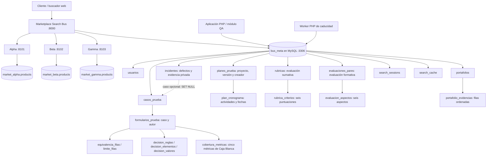

# Arquitectura de ISA3-P

El Bus consulta simultáneamente tres proveedores HTTP mediante cURL, normaliza sus contratos con adaptadores y aplica ordenamiento global. Persiste una SearchSession y su caché en `bus_meta`; el worker elimina físicamente las búsquedas caducadas y la clave foránea elimina su caché. Los catálogos de los proveedores viven en bases independientes.

El Proyecto 2 extiende el router, la autenticación y la navegación del Proyecto 1. La misma aplicación sirve `/login`, `/admin`, `/dashboard`, `/casos`, `/formularios`, `/usuarios`, `/busquedas` y el buscador. Apache puede servirla desde una subcarpeta; el servidor PHP del Bus utiliza el mismo router en 8000. No existe un segundo login ni una base QA independiente.

`usuarios` incorpora Administrador y Tester con contraseñas hash. `casos_prueba` referencia al autor; los permisos se comprueban en el servidor. El Administrador puede consultar y eliminar todos los casos; el Tester consulta y edita los propios. Las evidencias están en `.runtime/evidence`, fuera de Git y del acceso estático, y sus metadatos en MySQL. Las sesiones PHP se guardan en `.runtime/sessions`.

Las bases se extienden mediante SQL aditivo. Los datos de casos no expiran con las búsquedas. Los Formularios 2–5 guardan documentación relacional vinculada al Formulario 1 y a su creador, con permisos comprobados por documento. El Formulario 5 calcula porcentajes a partir de conteos ingresados por el tester; no importa datos automáticamente de herramientas externas.

El Formulario 6 utiliza `planes_prueba` y `plan_cronograma`: es un documento a nivel proyecto, sin `caso_id` ni vínculo con `formularios_prueba`. Conserva un creador y un Responsable académico por separado y permite varios planes/versiones. Se sirve desde `/formularios/plan`. Los Formularios 1–10 están completos. Consulta [Caja Negra](formularios-caja-negra.md), [cobertura](formulario-cobertura.md) y [plan del proyecto](plan-pruebas.md); la documentación UML complementaria se encuentra en `docs/uml/`.

Los Formularios 7–9 guardan evaluaciones y evidencias en seis tablas independientes de los casos, con creador de sesión inmutable y permisos por documento. Totales y promedios se calculan en servidor a partir de puntuaciones registradas por el usuario. El portafolio organiza nombres/descripciones sin adjuntos. Consulta [evaluación y evidencias](evaluacion-evidencias.md).

El Formulario 10 usa `incidentes`, con creador inmutable y caso opcional. La clave foránea SET NULL conserva el defecto al eliminar el caso. Los incidentes aparecen en una sección separada de su ficha, con permisos por incidente. `PrivateEvidence` comparte el almacenamiento/descarga privado con el Formulario 1 y admite TXT/LOG para incidentes; los archivos no se guardan en MySQL. Consulta [registro de incidentes](incidentes.md).

Localmente XAMPP controla Apache y MySQL. Los scripts `start-dev.ps1` y `stop-dev.ps1` controlan exclusivamente PHP propio. CI usa MariaDB efímera y procesos PHP controlados por `tests/smoke-bus.php`, sin despliegue ni dependencia del entorno local.
